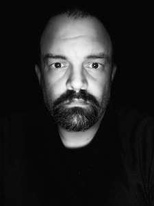

# Random Stuff About Me.

Yep, that's me. You're probably wondering what the hell I'm doing here&hellip;

- The day I was born was the same day the Apollo 16 astronauts ended their stay on the surface of the moon. I have their mission patch on my bulletin board for inspiration.

- I am high-functioning autistic (Asperger Disorder, specifically) along with living with Social Anxiety Disorder and Arrested Development Disorder. Around the right people, though, I can be a force to be reckoned with. I'm a kid trapped in the body of a late-forty-something.

- I was bullied daily from the second grade through the end of high school.

- Born and raised in Santa Ana, California; moved to Florida in 2000 for love and marriage (and now I'm stuck here, but it's grown on me).

- First marriage: 9&frac12; years, one adopted son. Divorced. I pay child support but do not have any visitation (my choice; didn't want a child to end up a pawn). The ex and I remain on friendly terms but rarely correspond.

- Second marriage: My junior-high crush. 3&frac12; years until she quite literally and unexpectedly dropped dead. So add "widower" and "very, very lonely" to "divorced".

- I am a _nerd_, by the most literal sense of the term. I am in front of a computer screen almost every waking hour (somebody take me out, please!). Think Sheldon Cooper, but far less of an a**hole. 

- I work from home full-time in a data analysis/reporting job. My immediate supervisor is in _Ohio._

- I have the following annual passes:
  - [Universal Orlando Resort](https://universalorlando.com) Platinum Pass (Express after 4! I hate being in lines, especially alone!)
  - [Busch Gardens](https://buschgardens.com/tampa) and [SeaWorld Orlando](https://seaworld.com/orlando) combined Gold Pass
  - [Kennedy Space Center (KSC) Visitor Complex](https://kennedyspacecenter.com) Atlantis Annual Pass
  - (I don't currently have a pass to [Walt Disney World](https://waltdisneyworld.com). My Platinum Pass expired in March during the COVID lockdowns and I didn't renew it before they stopped selling them.)

- You can usually find me at Universal Orlando on Sunday evenings, **in full _Wizarding World_ cosplay** (Yes, I am a grown 48-year-old man with a $125 Ravenclaw robe, Severus Snape's interactive wand, Ravenclaw quidditch cap, and face covering; these are my people). **Fantasy worlds inspire me.**

- I like to watch rocket launches up close (thus the KSC pass). I've seen two so far. **Space travel and technology inspire me.**

- **Faith inspires me.** I grew up Catholic, became a "born-again" Christian at the age of 14. My bachelor's degree is in pastoral ministry but life happened and I never got to use it for much of anything. I believe faith needs to be both _intimate_ and _intelligent_. I'm just as comfortable in a Catholic mass as in a pentecostal assembly.

- **Music inspires me.** I'm constantly listening to it, and for several years I [wrote a lot of my own](https://soundcloud.com/inmysilence). I still compose things every now and then, but when my wife passed I lost my muse. I need another one. Only kind I don't like is most rap and the darkest forms of death metal.

- **I love animals.** My current living situation in a tiny apartment doesn't provide for having any of my own, but I grew up with dogs and cats and in the past I've had guinea pigs and ferrets of my own. (Ferrets are like toddlers on a gallon of Red Bull but they are so much fun.)

- Outside of my geek gear, **I'm pretty minimalist and low-maintenance.** I live in a ~500 square-foot, one-bedroom apartment, with four IKEA tables, a book shelf, and an air mattress for furniture. That's all I need.

- I'm organized like crazy in my job, but at the threshold of my home, organization as mankind knows it ceases to exist. You may sometimes find it clean and shiny; you may sometimes walk onto the set of "Hoarding: Buried Alive." Apparently that is an autistic trait of mine.

- I have a very hard time sitting/standing still. Another autistic trait.

- My love language is _definitely_ touch. Arms around a lover, hugs, cuddling, sex (I don't focus just on the last one, FYI. Loving sex in a life-long bond is _far_ better than anything casual, not that I've ever tried casual.)

Anything else you wanna know? Just ask; the answer may end up here.